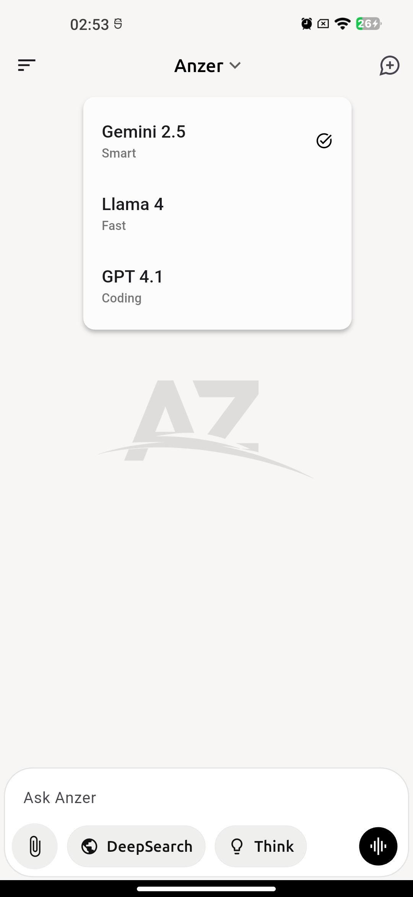
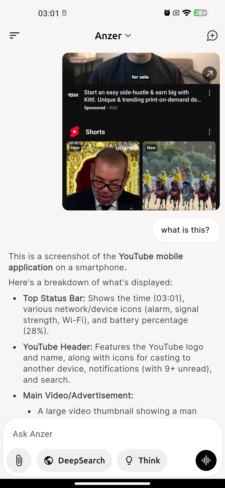

# Anzer AI Chat App

A modern Flutter-based AI chat application that provides an intuitive interface for conversing with AI models. The app features authentication, multi-modal conversations (text and images), conversation history, and multiple AI model selection.

---

## Features

### 🔐 Authentication System

- **Login Page**: Secure login with username/password authentication.
- **Skip Login**: Option to bypass authentication for quick access.
- **Persistent Login**: Auto-login for returning users using `SharedPreferences`.
- **Logout Functionality**: Secure logout with confirmation dialog.

### 💬 Chat Interface

- **Multi-Modal Chat**: Support for text and image inputs.
- **Real-time Messaging**: Instant AI responses with smooth animations.
- **Message Actions**: Copy, share, like/dislike AI responses.
- **Markdown Support**: Rich text formatting in AI responses with clickable links.
- **Auto-scroll**: Automatic scrolling to the latest messages.

### 🤖 AI Model Selection

- **Multiple Models**: Choose between Gemini 2.5, Llama 4, and GPT 4.1.
- **Model Switching**: Easy model selection via dropdown menu.
- **Model-specific Features**: Different capabilities (Smart, Fast, Coding).

### 📸 Image Support

- **Image Upload**: Support for camera and gallery image selection.
- **Image Preview**: Preview selected images before sending.
- **Multi-image Support**: Send multiple images in a single message.
- **Image Grid**: Organized display of images in user messages.

### 🔧 Advanced Features

- **DeepSearch**: Enhanced search capabilities (toggleable).
- **Think Mode**: Advanced reasoning mode (toggleable).
- **Voice Input**: Voice message support (placeholder for future implementation).
- **New Conversation**: Clear chat history and start fresh.

### 📱 User Interface

- **Modern Design**: Clean, intuitive interface with rounded corners and smooth animations.
- **Dark/Light Elements**: Thoughtful color scheme with proper contrast.
- **Responsive Layout**: Adapts to different screen sizes.
- **Custom Fonts**: Google Fonts integration (Ubuntu, Inter, Source Code Pro).

### 📊 Conversation Management

- **Conversation History**: Persistent chat history in drawer.
- **Search Conversations**: Find specific conversations quickly.
- **Conversation Actions**: Pin, rename, and delete conversations.
- **User Profile**: Display user information and profile picture.

---

## Installation & Setup

### Prerequisites

- Flutter SDK (latest stable version).
- Dart SDK.
- Android Studio / VS Code.
- Android/iOS device or emulator.

### Environment Setup

1. **Clone the repository**:
   ```bash
   git clone <repository_url>
   ```
2. **Create `.env` file** in the project root:
   ```env
   GEMINI_API_KEY=your_gemini_api_key_here
   ```
3. **Install dependencies**:
   ```bash
   flutter pub get
   ```
4. **Add assets**:
   - Add `logo-anzer.png` to `assets/images/`.
   - Add `profile.jpeg` to `assets/images/`.

### Running the App

Run the app on your device or emulator:
```bash
flutter run
```

### Build for Production

- **Android**:
  ```bash
  flutter build apk --release
  ```
- **iOS**:
  ```bash
  flutter build ios --release
  ```

---

## Dependencies

### Main Dependencies

- `flutter/material.dart` - Material Design components.
- `google_fonts` - Custom font integration.
- `flutter_dotenv` - Environment variables.
- `shared_preferences` - Local data persistence.
- `http` - HTTP requests for API calls.
- `image_picker` - Camera and gallery access.
- `flutter_markdown` - Markdown rendering.
- `url_launcher` - External link handling.
- `share_plus` - Native sharing functionality.

### Dev Dependencies

- Standard Flutter testing framework.
- Flutter Lints for code quality.

---

## Project Structure

```
lib/
├── main.dart                 # App entry point and routing
├── pages/
│   ├── login.dart           # Authentication screen
│   └── chat.dart            # Main chat interface
├── services/
│   └── chat_service.dart    # API communication service
└── widgets/
    ├── ai_message.dart      # AI message bubble widget
    ├── user_message.dart    # User message bubble widget
    └── drawer.dart          # Navigation drawer widget
```

---

## API Integration

The app integrates with Google's Gemini API for AI responses. The `ChatService` class handles:

- Message formatting for API requests.
- Image encoding (Base64).
- Conversation history management.
- Error handling and response parsing.

---

## Screenshots

### Authentication Flow


### Main Chat Interface


### AI Model Selection



### Image Features

| Image Selection                                                 | Image Preview                                               | Image in Chat                                            |
|-----------------------------------------------------------------|-------------------------------------------------------------|----------------------------------------------------------|
|  |  |  |

### Message Features

| AI Response                                             | AI Response with Images                                  |
|---------------------------------------------------------|---------------------------------------------------------|
|  |  |

### Navigation & Settings

| Drawer Menu                                   | Conversation Search                           |
|-----------------------------------------------|-----------------------------------------------|
|  |  |

### Conversation Management


`